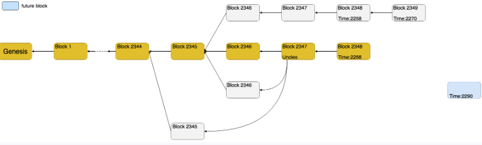

# Ethereum Block and Network


In all blockchain projects, the data structure composed of blocks is one of the core. The reason why it is called "blockchain" is precisely because these projects organize all blocks in a chain structure, and Ethereum is no exception. Of course, in addition to the chain structure, some other functions have been added to Ethereum, such as the maintenance of uncle blocks, main chain and side chain, etc.


The code about the blockchain structure in Ethereum is located in three directories:

1. core (only contains go files in the directory)
2. core/rawdb
3. light


The go file in the core directory contains almost all important functions and is the core code of the Ethereum blockchain. Among them, the BlockChain structure and method implemented in blockchain.go is the core implementation; the HeaderChain implemented in headerchain.go realizes the management of block headers.

The core/rawdb directory implements methods for **reading and writing all block structures from the database**. From these codes you can see how the blockchain is organized in the code.

The code in the light directory implements the organization and maintenance of the blockchain **in the light synchronization mode** (described later).


### What is Block and Chain

From wiki,

> Blockchain is a series of transaction records (also known as blocks) that are connected and protected by cryptography. Each block contains the encrypted hash of the previous block, the corresponding time stamp and transaction data (usually represented by the hash value calculated by the Merkle tree algorithm) [7], this design makes the content of the block difficult to tamper characteristics. The distributed ledger connected by the blockchain allows two parties to effectively record the transaction, and the transaction can be permanently verified.

Almost all blockchain projects are essentially about recording and confirming **transactions**. And this recording and confirmation is carried out through blocks. That is to say, after the miners check the legality of some **transactions**, they are packaged in the form of **blocks**, thus generating a new block data.

In each block, there will be a field to record the hash of its parent block. It is the hash of this parent block that forms the block into a one-way list structure similar to the data structure, also known as a "chain".

This is what blockchain is about.
The method of using the hash of the parent block to form a chain can prevent the block from being tampered with, because if a block is modified, its hash will change, resulting in a discrepancy with the hash recorded in the child block, thus making this Such modifications are not recognized.
The benefits of forming a chain also include easier handling of branching (i.e. forking). Just imagine that if blocks are organized in the form of an array, if there is a branch, it will definitely not be as convenient as a linked list.


The chain maybe looks like this,




Most blocks form a chain, and each block points to its own parent block until the **Genesis block**. But it is also easy to notice that there is not only one chain from the beginning to the end, but there are many long or short branch chains like "burrs". These branch chains are called **side chains**, and the main chain is the **main chain**, and this situation of branch chains is called a **fork**.

Each block will have a **height**, which is a count of the block's position on the chain. For example, the height of the genesis block is 0 because it is the first block. The height of the second block is 1, and so on. If we carefully observe the block height in the figure, we will find that the height of the last block on the main chain is not the largest. This shows that in Ethereum, the block height is not used to judge whether it is the main chain or the side chain. We will discuss this issue in more detail later.

Regardless of whether it is the main chain or the side chain, some blocks on the side chain are "included" back, that is to say, some blocks will not only point to the parent block, but may also point to the blocks of their own uncles. This is a more distinctive feature in Ethereum, called uncle block.

There are also some blocks that are not on the chain, these blocks are called **future blocks**. Ethereum sometimes receives some blocks with timestamps that are much larger than the parent block, so these blocks are temporarily stored as "future blocks". Try adding it to the chain when the time comes.


### Blocks

In core/types/block.go


```go
// Block represents an entire block in the Ethereum blockchain.
type Block struct {
   header       *Header  
   uncles       []*Header
   transactions Transactions
   withdrawals  Withdrawals

   // caches
   hash atomic.Value
   size atomic.Value

   // These fields are used by package eth to track
   // inter-peer block relay.
   ReceivedAt   time.Time
   ReceivedFrom interface{}
}

// Header represents a block header in the Ethereum blockchain.
type Header struct {
	ParentHash  common.Hash    `json:"parentHash"       gencodec:"required"`
	UncleHash   common.Hash    `json:"sha3Uncles"       gencodec:"required"`
	Coinbase    common.Address `json:"miner"`           //The address that accepts block rewards. Miners fill in their own addresses in this field when producing blocks.
	Root        common.Hash    `json:"stateRoot"        gencodec:"required"` // Hash of state, after all transactions done
	TxHash      common.Hash    `json:"transactionsRoot" gencodec:"required"` // hash of Block.transactions
	ReceiptHash common.Hash    `json:"receiptsRoot"     gencodec:"required"` // Receipt Hash
	Bloom       Bloom          `json:"logsBloom"        gencodec:"required"` // bloom filter to find the log
	Difficulty  *big.Int       `json:"difficulty"       gencodec:"required"`
	Number      *big.Int       `json:"number"           gencodec:"required"`
	GasLimit    uint64         `json:"gasLimit"         gencodec:"required"` // Upper for gas
	GasUsed     uint64         `json:"gasUsed"          gencodec:"required"` // used gas
	Time        uint64         `json:"timestamp"        gencodec:"required"` // Timestamp
	Extra       []byte         `json:"extraData"        gencodec:"required"` // extra Data, anything could be possible
	MixDigest   common.Hash    `json:"mixHash"`   // hashimoto
	Nonce       BlockNonce     `json:"nonce"`    //For PoW Miner

	// BaseFee was added by EIP-1559 and is ignored in legacy headers.
	BaseFee *big.Int `json:"baseFeePerGas" rlp:"optional"`

	// WithdrawalsHash was added by EIP-4895 and is ignored in legacy headers.
	WithdrawalsHash *common.Hash `json:"withdrawalsRoot" rlp:"optional"`

	/*
		TODO (MariusVanDerWijden) Add this field once needed
		// Random was added during the merge and contains the BeaconState randomness
		Random common.Hash `json:"random" rlp:"optional"`
	*/
}
```

More important fields about Block,

- Total Difficulty(Td)

  - ```go
    // TotalDifficultyAt calculates the total difficulty of the chain
    // at the given block height.
    func (c *Chain) TotalDifficultyAt(height int) *big.Int {
       sum := new(big.Int)
       if height >= c.Len() {
          return sum
       }
       for _, block := range c.blocks[:height+1] {
          sum.Add(sum, block.Difficulty())
       }
       return sum
    }
    ```

- receipts

- txlookupentries

  - It is used to query which block the transaction belongs to through the transaction hash.

- state

  - all accounts info.


### Chain and sidechains

The **chain** is the recognized chain, and subsequent newly generated blocks use the last block of the **chain** as the parent block. 

**Sidechains** are unacknowledged chains that may continue to grow, or stop there. If it continues to grow, its Td value may exceed the **chain** and become the **chain**. At this time, the original **chain** becomes a **sidechain** instead.

Ideally, all blocks are added one by one on the **chain**. The reality is that the blockchain project is a distributed project, and the nodes did not trust each other before. Suppose nodes A and B generate a **block** with the same height, and they respectively tell other nodes about this news. Then some nodes add A's block to the **chain**, and some nodes add B's block to the **chain**. This situation creates a **fork**. 

If there is only one **chain** and nodes do not recognize other branches, then this **fork** will continue forever. This is obviously not acceptable.

Therefore, in Ethereum, the **chain** and **sidechains** exist in the database at the same time. Every time a new **block** is added, it is re-judging whether the branch where the newly added block is located has become the **chain**. If it becomes the **chain**, it needs to be adjusted, and the branch where the newly added block is located becomes the **chain**, and the original **chain** is canceled at the same time.


This is the code how Blockchain decide to reorg.

```go
// writeBlockWithState writes block, metadata and corresponding state data to the
// database.
func (bc *BlockChain) writeBlockWithState(block *types.Block, receipts []*types.Receipt, state *state.StateDB) error {
   // Calculate the total difficulty of the block
   ptd := bc.GetTd(block.ParentHash(), block.NumberU64()-1)
   if ptd == nil {
      return consensus.ErrUnknownAncestor
   }
   // Make sure no inconsistent state is leaked during insertion
   externTd := new(big.Int).Add(block.Difficulty(), ptd)

   // Irrelevant of the canonical status, write the block itself to the database.
   //
   // Note all the components of block(td, hash->number map, header, body, receipts)
   // should be written atomically. BlockBatch is used for containing all components.
   blockBatch := bc.db.NewBatch()
   rawdb.WriteTd(blockBatch, block.Hash(), block.NumberU64(), externTd)
   rawdb.WriteBlock(blockBatch, block)
   rawdb.WriteReceipts(blockBatch, block.Hash(), block.NumberU64(), receipts)
   rawdb.WritePreimages(blockBatch, state.Preimages())
   if err := blockBatch.Write(); err != nil {
      log.Crit("Failed to write block into disk", "err", err)
   }
   // Commit all cached state changes into underlying memory database.
   root, err := state.Commit(bc.chainConfig.IsEIP158(block.Number()))
   if err != nil {
      return err
   }
   // If we're running an archive node, always flush
   if bc.cacheConfig.TrieDirtyDisabled {
      return bc.triedb.Commit(root, false)
   }
   // Full but not archive node, do proper garbage collection
   bc.triedb.Reference(root, common.Hash{}) // metadata reference to keep trie alive
   bc.triegc.Push(root, -int64(block.NumberU64()))

   current := block.NumberU64()
   // Flush limits are not considered for the first TriesInMemory blocks.
   if current <= TriesInMemory {
      return nil
   }
   // If we exceeded our memory allowance, flush matured singleton nodes to disk
   var (
      nodes, imgs = bc.triedb.Size()
      limit       = common.StorageSize(bc.cacheConfig.TrieDirtyLimit) * 1024 * 1024
   )
   if nodes > limit || imgs > 4*1024*1024 {
      bc.triedb.Cap(limit - ethdb.IdealBatchSize)
   }
   // Find the next state trie we need to commit
   chosen := current - TriesInMemory
   flushInterval := time.Duration(atomic.LoadInt64(&bc.flushInterval))
   // If we exceeded time allowance, flush an entire trie to disk
   if bc.gcproc > flushInterval {
      // If the header is missing (canonical chain behind), we're reorging a low
      // diff sidechain. Suspend committing until this operation is completed.
      header := bc.GetHeaderByNumber(chosen)
      if header == nil {
         log.Warn("Reorg in progress, trie commit postponed", "number", chosen)
      } else {
         // If we're exceeding limits but haven't reached a large enough memory gap,
         // warn the user that the system is becoming unstable.
         if chosen < bc.lastWrite+TriesInMemory && bc.gcproc >= 2*flushInterval {
            log.Info("State in memory for too long, committing", "time", bc.gcproc, "allowance", flushInterval, "optimum", float64(chosen-bc.lastWrite)/TriesInMemory)
         }
         // Flush an entire trie and restart the counters
         bc.triedb.Commit(header.Root, true)
         bc.lastWrite = chosen
         bc.gcproc = 0
      }
   }
   // Garbage collect anything below our required write retention
   for !bc.triegc.Empty() {
      root, number := bc.triegc.Pop()
      if uint64(-number) > chosen {
         bc.triegc.Push(root, number)
         break
      }
      bc.triedb.Dereference(root)
   }
   return nil
}
```


This is the Blockchain how to reorg.

```go
// reorg takes two blocks, an old chain and a new chain and will reconstruct the
// blocks and inserts them to be part of the new canonical chain and accumulates
// potential missing transactions and post an event about them.
// Note the new head block won't be processed here, callers need to handle it
// externally.
func (bc *BlockChain) reorg(oldBlock, newBlock *types.Block) error {
   var (
      newChain    types.Blocks
      oldChain    types.Blocks
      commonBlock *types.Block

      deletedTxs []common.Hash
      addedTxs   []common.Hash
   )
   // Reduce the longer chain to the same number as the shorter one
   // Find the common ancestor commonBlock of the two branches of oldBlock and newBlock, Record all blocks on the path to the common ancestor in newChain and oldChain respectively. At the same time, put all transactions on the branch of oldBlock into deletedTxs.
   if oldBlock.NumberU64() > newBlock.NumberU64() {
     ...
   }
}
```


The method of writing a block to the main chain is actually very simple, that is, to create a record from the block height to the block hash in the database. When we only use the block height to get a block, what we get is the block on the main chain; at the same time, the main chain will have a mark that records the hash of the latest block on the main chain.


### pruned block

In October 2017, the data of Ethereum had reached more than 300G, and it would soon exceed 1T. Such a large amount of data is unacceptable for an ordinary user.

The Ethereum team solved this problem by pruning block data. To be precise, what is pruned is actually state data, because the final reason for the rapid growth of Ethereum data is not the increase in the number of blocks, but the growth of state data. So why does the amount of state data grow so fast? This starts with how the state is implemented.


Is it necessary for an Ethereum node to store all historical data of the state? In most cases it is not needed. For those data that are not needed, we can not store them. In case we need to use it one day, we can spend some time to recalculate the data because the complete block information is saved.

The method provided by Ethereum is to prune the nodes of the trie tree. In the implementation of trie, "reference counting" will be performed on the nodes existing in memory, that is, each node has a number that records the number of times it is referenced. When the number of references becomes 0, the node memory will be released. will not be written to the database.


### 3 Synchronization Modes

full、fast、light.

##### full mode

As the name suggests, "full mode" synchronizes all block data. In full mode, the synchronization module calls BlockChain.InsertChain to insert block data obtained from other nodes into the database. In BlockChain.InsertChain, the state and receipts data of each block will be calculated and verified one by one. If everything is normal, the synchronized block data and the state and receipts data calculated by itself will be written into the database together.

Note that there are two processing methods in full mode, one of which saves all historical data, and this node is called "archive node". The other prunes the state. To become an "archive node", set the NoPruning field in the configuration file to true.

##### fast mode

The so-called "quick mode" is relative to the "full mode". In full mode, the state and receipts are calculated on the current machine based on the transactions in the block data. In fast mode, state and receipts are no longer calculated locally, but are directly synchronized from other nodes just like block data. Therefore, in the fast mode, the synchronous mode calls BlockChain.InsertReceiptChain to write the synchronized blocks and receipts directly into the blockchain database; and the state is also directly written into the library through stateDb.

There is a currentFastBlock field in BlockChain, which represents the latest block on the main chain in fast mode.

It can be seen that the fast mode replaces the local calculation of the state and receipts in the full mode by using the network direct synchronization method, and replaces the local computing resources with the network bandwidth.

##### light mode

Light mode, also called light mode, is a mode that only synchronizes block headers. In the light mode, the blockchain organization does not use the blockchain module, but the light module. This module is located in the "light" directory under the Ethereum project. The biggest difference from the blockchain module is that the light module only calls the related methods of HeaderChain to process the block header, but not other data. Only when other data other than the header of a certain block is needed, the required data is obtained.

When calling loadLastState, if the state of currentBlock does not exist, then call repair to obtain and search up the currentBlock until a state exists.


### Questions


- What is the average block interval time of Ethereum?
  - The average block interval time of Ethereum is around 13-15 seconds
- What is the average block size of Ethereum?
  - The average block size of Ethereum varies depending on the number of transactions being processed, but it typically ranges between 20-30 kilobytes.
- What are nodes in Ethereum? How can one connect to Ethereum nodes?
  - Nodes in Ethereum refer to any computer or device that is connected to the Ethereum network and participates in validating transactions and maintaining the blockchain. One can connect to Ethereum nodes using a client program such as Geth or Parity, which allows communication with the network through the use of JSON-RPC APIs.
- What are the methods for interacting with the Ethereum network?
  - There are several methods for interacting with the Ethereum network, including:
    - Using a client program such as Geth or Parity
    - Using a web3.js library to communicate with the network through a web browser
    - Utilizing a third-party service or API provider
    - Deploying and interacting with smart contracts on the Ethereum Virtual Machine (EVM)
- Name some Types of Ethereum Networks?
  - Some types of Ethereum networks include the mainnet, testnets such as Ropsten and Rinkeby, and private networks used for development and testing purposes.
- What is an Ethereum Client?
  - An Ethereum client is a software program that is used to connect to the Ethereum network and participate in the validation of transactions and maintenance of the blockchain. Examples of Ethereum clients include Geth, Parity, and Besu.
- How does a blockchain recognize a Block?
  - A blockchain recognizes a block through a combination of its hash value, which is calculated based on the transactions contained within the block, and the hash value of the previous block in the chain. When a new block is added to the blockchain, it must be validated by a network of nodes to ensure that its hash value matches the previous block and that its transactions are valid.
- In a Blockchain database, what various kinds of records can you find?
  - In a blockchain database, you can find various kinds of records, including transactions, blocks, addresses, and smart contracts. Transactions record the transfer of cryptocurrency or other assets between parties, blocks group transactions together and form the basis of the blockchain, addresses are unique identifiers used to send and receive assets, and smart contracts are self-executing code that can be deployed and executed on the blockchain.
- Is it possible to make changes to the data after it has been written in a block?
   - Once data has been written to a block on the blockchain, it is extremely difficult, if not impossible, to change it. This is because the blockchain uses a cryptographic hash function to link each block to the previous one, creating an immutable chain of blocks. Any attempt to modify the data in a block would change its hash value, which would in turn invalidate all the subsequent blocks in the chain. Therefore, the blockchain is considered to be a secure and tamper-resistant way to store data.
- Why use Ethereum private chains when the Ethereum main chain is already powerful?
  - While the Ethereum main chain is powerful and widely used, there are situations where a private Ethereum blockchain may be more appropriate. Private chains offer greater control over the network, allowing organizations to customize network parameters and restrict access to specific participants. This can be useful for companies that require a high degree of privacy, security, and control over their data and applications. Private chains can also offer faster transaction times and lower transaction fees compared to the public Ethereum network.
- How can I view detailed information about a transaction or block?
  - To view detailed information about a transaction or block on the Ethereum main chain, you can use a blockchain explorer such as Etherscan. Simply enter the transaction hash or block number into the search bar and you will be able to see detailed information about the transaction or block, including the sender and recipient addresses, transaction fee, gas used, and more.
- How can I view detailed information about a transaction or block on a private Ethereum chain?
  - To view detailed information about a transaction or block on a private Ethereum chain, you will need to access the blockchain's node or use a blockchain explorer specifically designed for that private chain. Depending on the specific implementation of the private chain, you may need to obtain special permissions or access credentials to view this information.