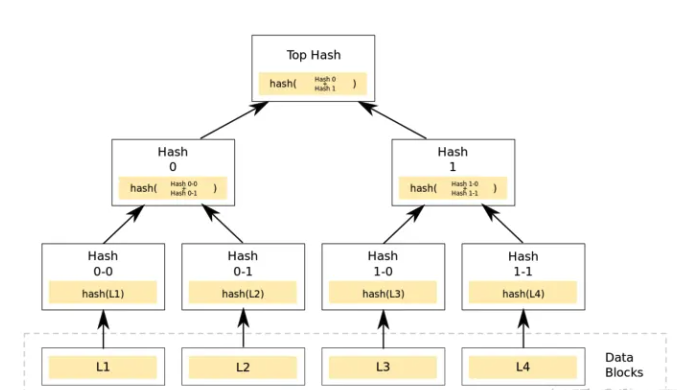

# Trie


Trie (Merkle Patricia Tree, also known as MPT) is a tree structure used to encrypt and store any (key, value) data pair in ethereum. Its insertion, search and deletion efficiency are all O(log(N)), but it is simpler and easier to understand than other tree structures such as red-black trees, and it also has the characteristics of Merkle trees.


Ethereum accounts have multiple attributes (balance, code, storage information), and attributes (status) need to be updated frequently. Therefore, a data structure is needed to meet several requirements:

1. A new tree root can be quickly calculated after performing an insert, modify, or delete operation without recalculating the entire tree.
2. Even if the attacker deliberately constructs a very deep tree, its depth is limited. Otherwise, an attacker could perform a denial of service attack by deliberately building a tree deep enough that each tree update is extremely slow.
3. The root value of the tree depends only on the data, not on the order of updates. Updating in a different order, or even recomputing the tree from scratch will not change the root value of the tree.


### Normal Trie

> Trie, also known as prefix tree or **dictionary tree**, is an ordered tree used to save associative arrays, the keys of which are usually strings. Unlike a binary search tree, the key is not stored directly in the node, but is determined by the node's position in the tree. All descendants of a node have the same prefix, which is the string corresponding to this node, and the root node corresponds to the empty string.


In the figure above, each node is actually just a part of the key, or a character of the key. When traversing down according to a certain key until the last character of the key, the value corresponding to the key is also found.
This way of looking up value is exactly the same as looking up a dictionary m


This is how we save 8 key-value pairs.

```text
Key			value
6c0a5c71ec20bq3w	5
6c0a5c71ec20CX7j	27
6c0a5c71781a1FXq	18
6c0a5c71781a9Dog	64
6c0a8f743b95zUfe	30
6c0a8f743b95jx5R	2
6c0a8f740d16y03G	43
6c0a8f740d16vcc1	48
```

#### **Merkle Tree**

Merkle Tree, also commonly called Hash Tree, as the name suggests, is a tree that stores hash values.
The main function of the Merkle Tree is that when the Top Hash is obtained, the hash value represents the information summary of the entire tree. When any data in the tree changes, the value of the Top Hash will change. The value of Top Hash will be stored in the block header of the blockchain.




### Ethereum Trie

- ①在执行插入、修改或者删除操作后能快速计算新的树根，而无需重新计算整个树。
- ②即使攻击者故意构造非常深的树，它的深度也是有限的。否则，攻击者可以通过特意构建足够深的树使得每次树更新变得极慢，从而执行拒绝服务攻击。
- ③树的根值仅取决于数据，而不取决于更新的顺序。以不同的顺序更新，甚至是从头重新计算树都不会改变树的根值。


Fixme:

https://zhuanlan.zhihu.com/p/50242014

https://learnblockchain.cn/books/geth/part3/mpt.html